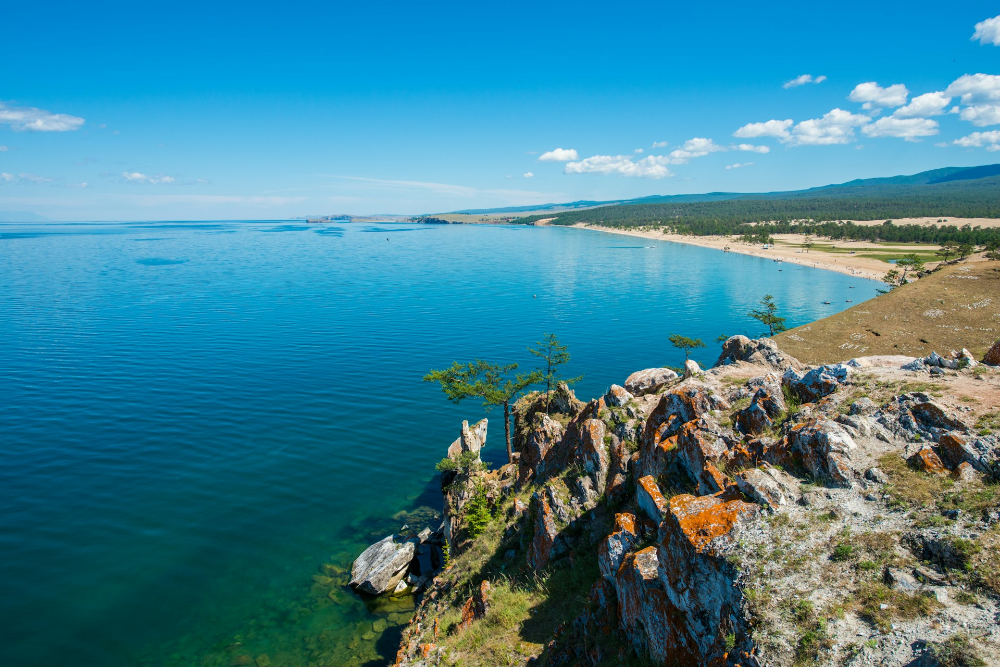

# GreenPath
**Центр устойчивого туризма и экопутешествий**

## Описание проекта
"GreenPath" предлагает экологичные туры и путешествия в уникальные природные места. Наша цель — создать современный, удобный и привлекательный веб-ресурс, который отражает философию устойчивого туризма и предлагает пользователям легкий доступ к экотуризму.

## Основные продукты/услуги
- **Индивидуальные и групповые экотуры** по природным заповедникам и национальным паркам.
- **Водные экскурсии, пешие походы** и активный отдых (каякинг, треккинг, йога на природе).
- **Семинары и тренинги** по экологическому туризму и осознанному путешествию.
- **Организация экологических мероприятий** и волонтерских программ.

## География распространения
Основные рынки: Россия, Казахстан, Монголия. Есть клиенты из Европы и США.  
**Целевая аудитория:** Путешественники из городов с экологическим мышлением, ценящие осознанный туризм.

## Прямые конкуренты
- [Elenatravelblog](https://elenatravelblog.com/eco-travel)
- [Kamchatka Tour](https://kamchatka-tour.com/kamchatka/travel/eco.php)
- [Ecotravel](https://www.ecotravel.ru/)

## Целевая аудитория
Наши клиенты — осознанные путешественники, заинтересованные в сохранении природы и поддержке локальных сообществ.
- **Пол:** Мужчины и женщины.
- **Возраст:** 25-50 лет.
- **Доход:** Средний и выше среднего.
- **Образование:** Высшее, активно интересующиеся экологией и устойчивым развитием.
- **Стиль жизни:** Ведут активный образ жизни, предпочитают индивидуальные и малые групповые туры.

## Причины создания нового сайта
Мы хотим создать современный сайт, который передаст нашу философию устойчивого туризма. Старый сайт устарел как визуально, так и функционально: неудобная навигация, отсутствие адаптации под мобильные устройства.

## Структура сайта
1. **Туры и маршруты**
   - По странам (разделение на регионы).
   - По типу активности (походы, водные туры, йога-ретриты).
2. **Контакты**
   - Форма обратной связи.
3. **Корзина**
   - Выбор тура с уведомлением о связи в течение 12 часов.

## Ключевые функциональные возможности
- **Формы заявок:** Бронирование туров онлайн.
- **Онлайн-оплата:** Интеграция с платежными системами.
- **Личный кабинет:** Управление бронированиями.
- **Подписка на рассылку:** Получение новостей и специальных предложений.
- **Календарь туров:** Поиск по дате, региону, типу активности.
- **Отзывы клиентов:** Возможность оставлять отзывы.
- **Интеграция с CRM:** Автоматизированное управление клиентами.

## Иностранные версии сайта
Планируются версии на:
- Английском
- Русском

## Дизайн сайта
Сайт будет выполнен в легком, экологичном стиле:
- Использование зеленых, белых и нейтральных цветов.
- Природные элементы в оформлении (деревья, горы).
- Простая навигация и минимализм в дизайне.

## Заключение
Сайт "GreenPath" станет платформой для бронирования экотуров и источником информации о принципах устойчивого туризма. Он будет способствовать формированию сообщества осознанных путешественников, поддерживающих сохранение природы.
